# TRAE 灵感孵化舱

> **TRAE AI 创造力大赛 · 社会服务赛道**

> 一颗灵感种子，如何在 **TRAE** 中长成完整作品？

从灵光一闪到报名提交，这份指南将带你走过与 TRAE Work 协作共创的全部旅程。四步孵化，让每一个想法都有机会绽放。

| 阶段 | 名称 | 核心动作 |
|------|------|----------|
| 01 | 播种 | 种下你的灵感 |
| 02 | 浇灌 | 多轮对话迭代 |
| 03 | 修剪 | 整理产品思路 |
| 04 | 绽放 | 生成你的作品 |

---

## 快速入口

- [TRAE Work Go Go Go!](https://solo.trae.cn/)
- [Idea Hall 灵感大厅](https://luoqianshi.github.io/TRAE-AI-Creativity-Competition-Idea-Hall/)
- [Demo Wall 作品墙](https://luoqianshi.github.io/trae-demo-wall/)
- [大赛官网](https://www.trae.cn/ai-creativity)

---

## 01 · 播种。种下你的灵感

> `sow.the.idea` · 上传模板，唤醒 brainstorming

将大赛报名模板喂给 TRAE Work，激活结构化的创意梳理流程。

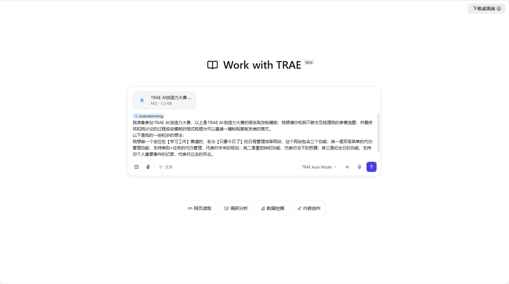

*REAL CASE · TRAE Work 灵感播种真实过程截图*

### 操作流程（4 步）

#### STEP 01 · 安装技能

首次使用 TRAE Work，前往左上角的【技能模块】，在【技能市场】的【效率提升】分类中安装 **brainstorming** 技能。

#### STEP 02 · 下载并上传报名模板

点击下方按钮下载模板，然后将大赛官方的报名发文模板 **.md** 文件拖入 TRAE Work 对话窗口，让 AI 理解输出格式要求。

> 模板下载：见文末「报名发文模板」章节。

#### STEP 03 · 启用技能

在粘贴提示词之前，输入 `/brainstorming` 显式启用技能，召唤出 **trae 宝** 为你参谋灵感设计。

#### STEP 04 · 粘贴提示词

复制下方提示词模板，填入你自己的灵感关键词后发送给 TRAE Work。

### 播种提示词 · 复制后粘贴到 TRAE Work

```
# 在上传模板文件后、粘贴此提示词前，请先用键盘输入：
/brainstorming

我准备参加TRAE AI创造力大赛，以上是TRAE AI创造力大赛的报名贴发帖模板，我想请你和我不断交互梳理我的参赛选题，并最终将和我讨论的过程按该模板的格式梳理为可以直接一键粘贴复制发表的推文。

以下是我的一些初步的想法：
[在这里尽情描述你的灵感，尽量描述你观察到的痛点、想服务的对象、以及你设想的产品形态]
```

> 💡 **关键结论**：brainstorming 技能会激活 TRAE AI 的引导式发问功能，结合报名模板以提问和给出建议方案的方式，引导你逐步把灵感沉淀为标准的报名帖。
> —— 灵感孵化舱 · 播种阶段

---

## 02 · 浇灌。多轮对话迭代

> `iterate.with.ai` · 与 AI 深度对话

通过 5-10 轮结构化交互，将模糊灵感打磨为清晰方案。以下为真实案例「只要今日了」的 7 轮对话全过程：

| 轮次 | 主题 | 对应截图 |
|------|------|----------|
| Round 1 | 产品定位 | 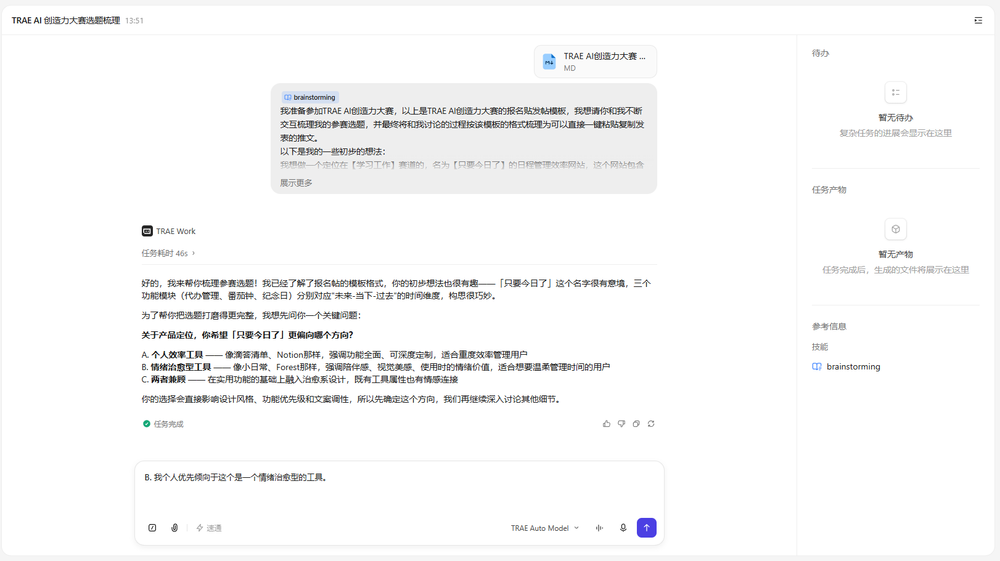 |
| Round 2 | 视觉风格 | 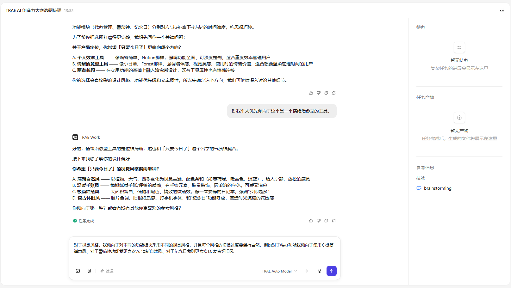 |
| Round 3 | 目标用户 | 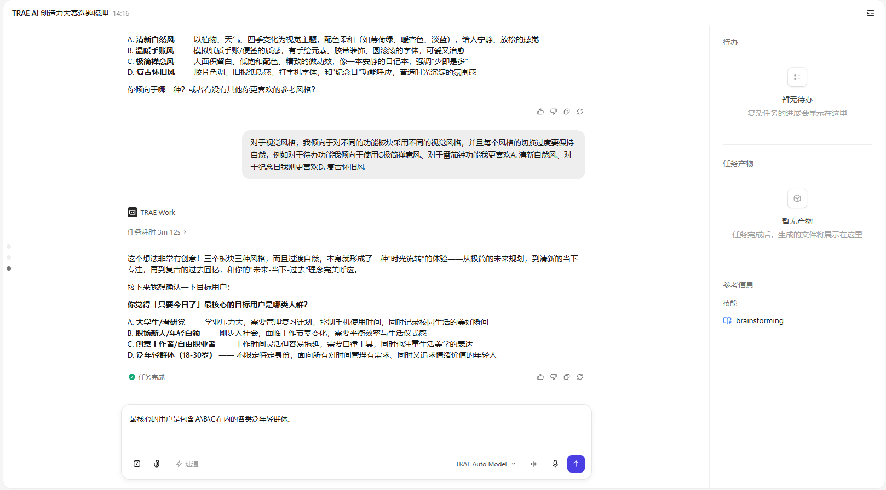 |
| Round 4 | 痛点洞察 | 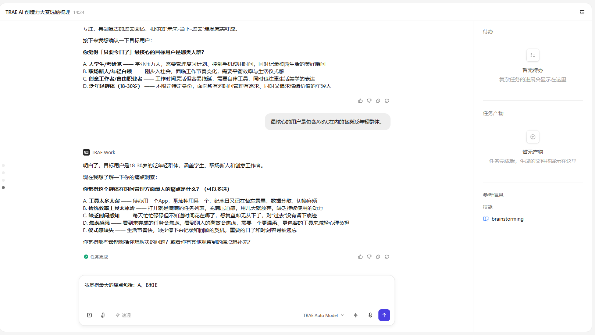 |
| Round 5 | 核心价值主张 | 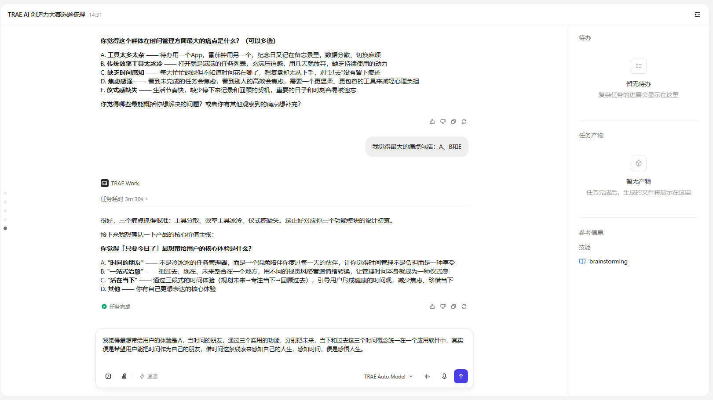 |
| Round 6 | 创意亮点 | 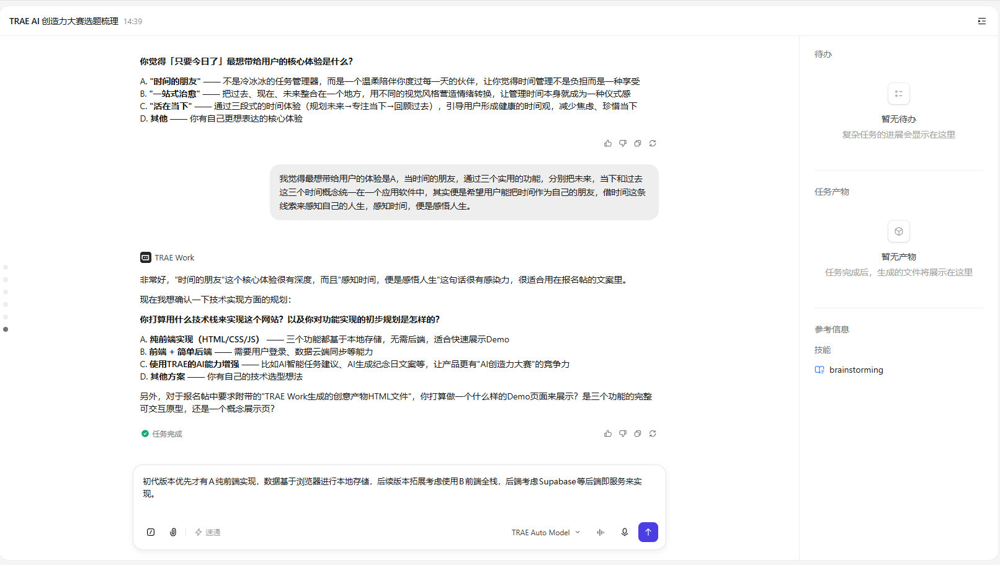 |
| Round 7 | 生成报名帖 | 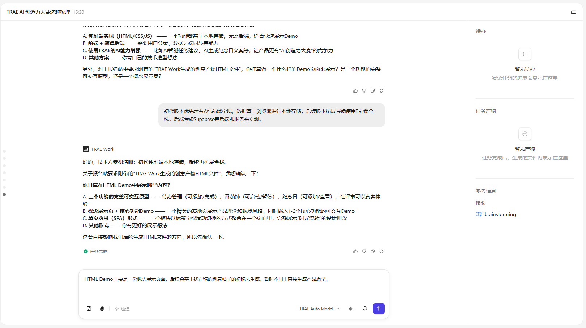 |

### ROUND 01 · 确认产品定位方向

TRAE Work 会先理解你的初始想法，然后给出 **3 个清晰的方向选项**（如"个人效率工具 / 情绪治愈型 / 两者兼顾"），并解释每个方向的差异。你只需 **选择字母** 即可完成回答，让 AI 帮你把模糊创意定位到具体方向。

### ROUND 02 · 选定视觉风格

AI 会推荐 **4 种风格调性**（如清新自然 / 温暖手账 / 极简禅意 / 复古怀旧），每种都附带详细的视觉特征描述。你可以直接选择，也可以像示例那样提出 **"每个模块用不同风格"** 的创新组合方案，TRAE Work 会主动呼应你的巧思。

### ROUND 03 · 确定目标用户

AI 会要求你从 **多个候选用户群**（学生 / 职场新人 / 创意工作者 / 泛年轻群体）中圈定最核心的服务对象。可以用 **"A\B\C 包含在内的泛年轻群体"** 这样的组合表达，让产品定位更精准。

### ROUND 04 · 痛点洞察（可多选）

AI 会抛出 **5 个常见痛点**（工具分散 / 效率工具冰冷 / 缺乏时间感知 / 焦虑感强 / 仪式感缺失），并说明 **可以多选**。挑选最贴合你产品的痛点，AI 会主动把答案与你的功能模块对应起来，验证你的设计逻辑。

### ROUND 05 · 提炼核心价值主张

AI 给出 **3 句候选核心体验**（如"时间的朋友 / 一站式治愈 / 活在当下"），帮你把前面的所有选择浓缩为一句 **打动人的价值主张**。这一句将直接出现在最终报名帖的"价值与意义"部分。

### ROUND 06 · 梳理创意亮点

AI 继续追问 **差异化亮点 / 独特之处**，比如"时光流转"式的视觉切换、"未来-当下-过去"的理念呼应等。这一步帮你把抽象概念落到 **可被感知的具体场景**，让评审一眼看到产品独特性。

### ROUND 07 · 生成最终报名帖

所有信息收集完毕后，TRAE Work 会 **按报名模板格式** 自动生成完整的报名帖文本（标题 + 标签 + 四大正文模块），你可以直接复制粘贴发布，**无需自己排版**。

> 💡 **关键结论**：在 TRAE Work 的引导下，根据 TRAE Work 的提问和提案做选择题并修正，直到初步打磨出一个灵感产品的雏形。
> —— 灵感孵化舱 · 浇灌阶段

---

## 03 · 修剪。整理产品思路

> `shape.the.idea` · 从碎片到结构化方案

将对话中沉淀的信息整理为清晰的产品框架。

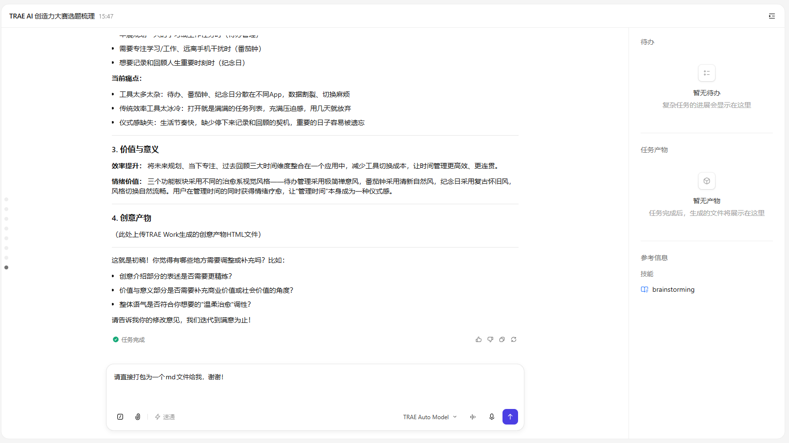

*REAL CASE · TRAE Work 提交初稿并主动询问 4 维修改建议*

### 修剪提示词 · 让 AI 整理思路

```
# 当 TRAE Work 按报名稿格式发送初稿后，进入修剪阶段：

# 如果方案满意，直接导出 md 文件：
请直接打包为一个 md 文件给我，谢谢！

# 如果需要进一步迭代，针对性修改后再导出：
# 1. 针对不满意的部分与 TRAE Work 交互
# 2. 确认满意后，发送：
请直接打包为一个 md 文件给我，谢谢！
```

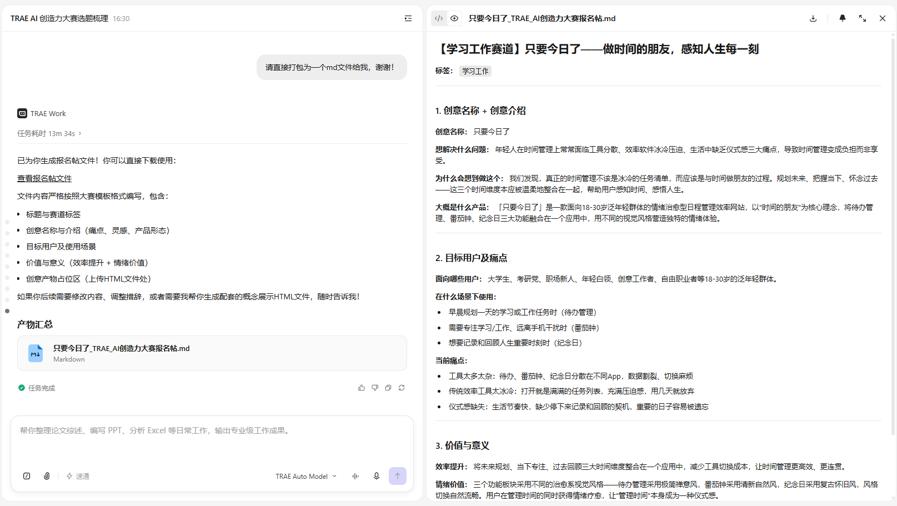

*REAL CASE · TRAE Work 按模板生成的「只要今日了」报名帖 .md 终稿*

### 6 个维度对齐角度

拿到 TRAE Work 生成的报名帖后，可以从以下 **6 个维度** 与 AI 反复对齐，直到确认终稿。每个维度都对应一个可优化的角度，让你的产品报名帖更具说服力。

| 维度 | 说明 |
|------|------|
| **创意名称** | 简洁有力的名字，让人一眼就知道你要做什么 |
| **目标用户** | 精准定义你的核心用户群体和使用场景 |
| **产品形态** | App / 小程序 / 网站 / 系统 / 硬件，选择最合适的载体 |
| **核心痛点** | 没有你的产品，用户现在会遇到什么不方便 |
| **价值与意义** | 从商业价值、效率提升、社会价值中选取角度论述 |
| **个性化** | 增加自想的其他内容，为报名帖注入独特的气质 |

> 💡 **关键结论**：确认方案满意后，一键导出 md 文件，报名所需材料完成 50%。
> —— 灵感孵化舱 · 修剪阶段

---

## 04 · 绽放。生成你的作品

> `ship.the.demo` · 从方案到可交付作品

用 TRAE 的前端生成能力，把文字方案变成有设计感的互动页面。

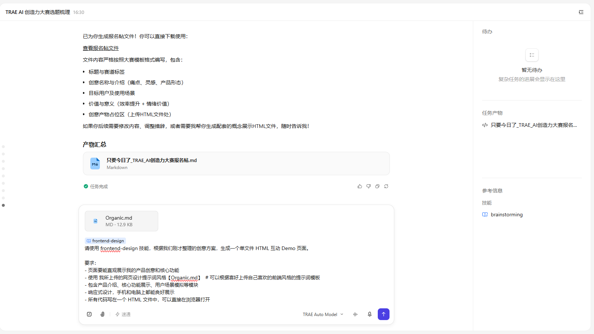

*REAL CASE · TRAE Work 加载 frontend-design 技能，根据 Organic.md 风格生成 HTML Demo*

### 绽放提示词 · 生成 HTML Demo

```
# 使用 frontend-design 技能生成 Demo：

/frontend-design

请使用 frontend-design 技能，根据我们刚才整理的创意方案，生成一个单文件 HTML 互动 Demo 页面。

要求：
- 页面要能直观展示我的产品创意和核心功能
- 使用 我所上传的网页设计提示词风格【Organic.md】  # 可以根据喜好上传自己喜欢的前端风格的提示词模板
- 包含产品介绍、核心功能展示、用户场景模拟等模块
- 响应式设计，手机和电脑上都能良好展示
- 所有代码写在一个 HTML 文件中，可以直接在浏览器打开
```

### 推荐的前端生成工具矩阵

TRAE Work 调用技能时，推荐使用以下 **5 个前端生成工具**：TRAE 官方内置 **2 个** 前端技能 + GitHub 社区推荐的 **2 个** 设计技能 + 1 个风格化提示词模板网站，覆盖从模板调用、风格指引到组件生成的完整链路。

| 工具 | 类型 | 说明 |
|------|------|------|
| **[frontend-design](https://www.trae.cn/ai-creativity)** | TRAE 官方 | TRAE 官方内置技能，专为生产级 Web App 打造，引导 AI 产出具备排版纪律与组件完整性的高质量前端方案。 |
| **[frontend-skill](https://www.trae.cn/ai-creativity)** | TRAE 官方 | TRAE 官方前端技能，承担通用页面、组件、布局等基础任务，是日常前端协作的万金油工具。 |
| **[huashu-design](https://github.com/alchaincyf/huashu-design)** | GitHub | 花叔开源的 HTML 原生设计技能，集成 20+ 视觉哲学指南，专注高保真 App 原型、PPT、动画、信息图等视觉产出。 |
| **[taste-skill](https://github.com/Leonxlnx/taste-skill)** | GitHub | Anti-Slop Frontend Framework，通过 DESIGN_VARIANCE / MOTION_INTENSITY / VISUAL_DENSITY 三大拨盘控制设计风格，让 AI 摆脱模板感。 |
| **[DesignPrompts.dev](https://www.designprompts.dev/)** | 模板网站 | 精选设计风格提示词模板库，覆盖 Monochrome / SaaS / Luxury / Cyberpunk / Brutalism / Organic 等 30+ 种风格，将模板直接喂给 AI 即可获得统一且具设计感的视觉输出。 |

> 💡 **关键结论**：当你的灵感经历播种、浇灌、修剪，最终以一份精美的报名帖和一个可交互的 Demo 呈现在社区面前时 —— 那一刻，就是绽放。
> —— 灵感孵化舱 · 绽放阶段

### 最终成果展示

#### 报名帖文本


- **格式**：markdown
- **使用方式**：copy & paste
- **说明**：TRAE Work 按模板格式生成的结构化报名帖，包含创意介绍、目标用户、价值意义四大部分

#### HTML Demo 文件

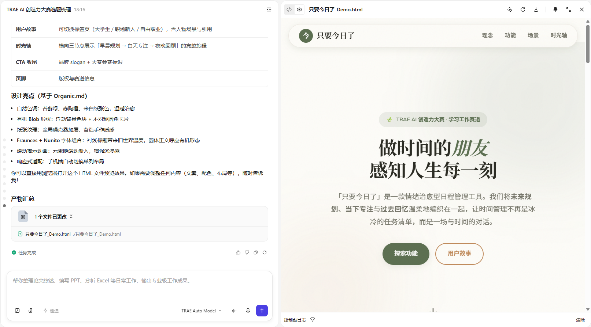

- **格式**：.html
- **使用方式**：single file
- **说明**：使用 frontend-design 技能生成的互动展示页面，视觉精美，可直接上传至社区展示

### 准备好投稿了吗？

将你的创意方案发布到 TRAE 社区，让更多人看到你的灵感！

👉 [报名去！](https://forum.trae.cn/c/38-category/39-category/39)

---

## 报名发文模板

以下是 TRAE AI 创造力大赛的官方报名发文模板结构，用于在「播种」阶段上传给 TRAE Work：

```markdown
**【标题】** 报名赛道 + 创意名称
**（示例：【学习工作赛道】AI 错题本——拍照自动整理孩子的错题）**

**【标签】** 按所选赛道选择话题标签：`生活娱乐` / `学习工作` / `社会服务` / `硬件交互`，**必须四选一**；如果参加附加赛题，还可加选「社会公益」标签。（一个报名帖只能选择1个赛道哦，社会公益可加选）

**【正文】** 不少于 100 字，至少包含以下 4 个部分，可增加其他部分

**1. 创意名称 + 创意介绍**
- 想解决什么问题：用 1–2 句话描述你发现的痛点或需求
- 为什么会想到做这个：简单说明动机或灵感来源
- 大概是什么产品：一句话概括产品形态（App/小程序/网站/系统/硬件等）

**2. 目标用户及痛点**
- 面向哪些用户：描述你的核心用户群体
- 在什么场景下使用：用户会在什么情况下用它
- 当前痛点：如果没有你的产品，用户现在会遇到什么不方便

**3. 价值与意义**
- 从商业价值、效率提升、社会价值中选 1–2 个角度，说明这个创意的价值

**4. 必须附带**
- 上传 TRAE Work 生成的创意产物 HTML文件（请直接上传到社区），用于更完整地展示你的创意方案。（建议模型使用Auto模式）
```

---

## 图片资源索引

| 图片 | 用途 | 所在阶段 |
|------|------|----------|
| [trae-black.png](assets/trae-black.png) | TRAE Logo（黑色版） | 全局 |
| [trae-white.png](assets/trae-white.png) | TRAE Logo（白色版） | 全局 |
| [trae_dark.png](assets/trae_dark.png) | TRAE Work 头像 | 全局 |
| [pic1.png](assets/pic1.png) | 灵感播种真实案例 | 01 · 播种 |
| [pic2.png](assets/pic2.png) | Round 1 · 产品定位 | 02 · 浇灌 |
| [pic3.png](assets/pic3.png) | Round 2 · 视觉风格 | 02 · 浇灌 |
| [pic4.png](assets/pic4.png) | Round 3 · 目标用户 | 02 · 浇灌 |
| [pic5.png](assets/pic5.png) | Round 4 · 痛点洞察 | 02 · 浇灌 |
| [pic6.png](assets/pic6.png) | Round 5 · 价值主张 | 02 · 浇灌 |
| [pic7.png](assets/pic7.png) | Round 6 · 创意亮点 | 02 · 浇灌 |
| [pic8.png](assets/pic8.png) | Round 7 · 生成报名帖 | 02 · 浇灌 |
| [pic9.png](assets/pic9.png) | 修剪阶段 · 初稿修改意见 | 03 · 修剪 |
| [pic10.png](assets/pic10.png) | .md 报名帖终稿 | 03 · 修剪 / 04 · 绽放 |
| [pic11.png](assets/pic11.png) | frontend-design 技能加载 | 04 · 绽放 |
| [pic-html-demo.png](assets/pic-html-demo.png) | HTML Demo 成品 | 04 · 绽放 |
| [pic-bmt.png](assets/pic-bmt.png) | 报名帖成品 | 04 · 绽放 |

---

## 关于

从灵光一闪到报名提交，让每一个想法都有机会在 **TRAE** 中绽放。

- 作者：[@骆谦实](https://forum.trae.cn/u/%E9%AA%86%E8%B0%A6%E5%AE%9E/summary)
- 大赛官网：[TRAE AI 创造力大赛](https://www.trae.cn/ai-creativity)
- TRAE Work：[https://solo.trae.cn/](https://solo.trae.cn/)
